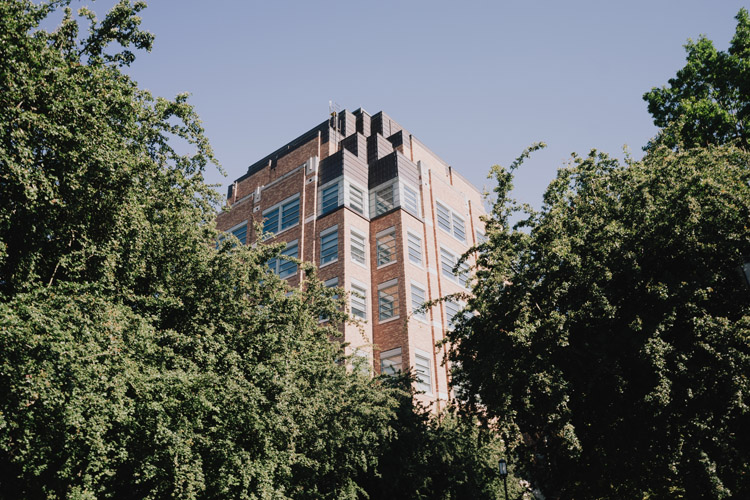
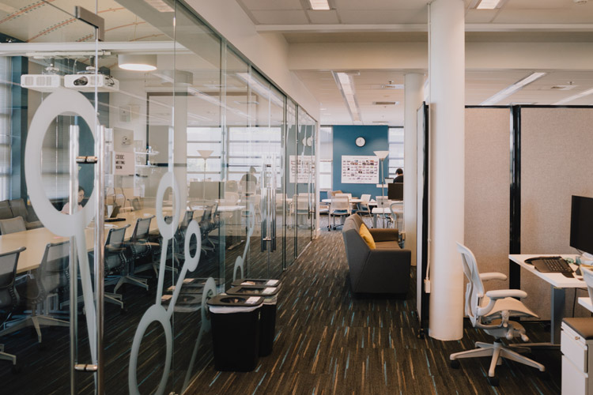
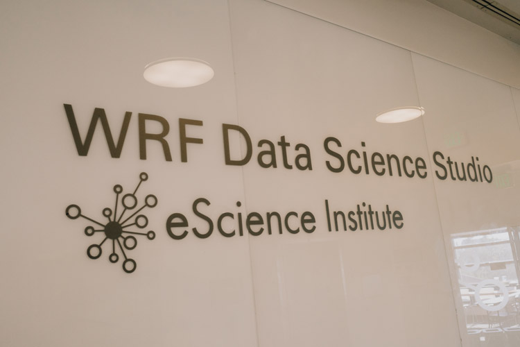
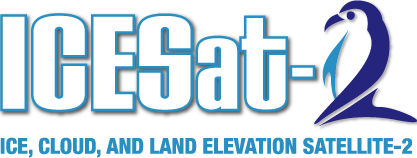

<h1 align="center">
  <br>
  <a href="https://escience.washington.edu/using-data-science/hackweeks/">
 </a>
<br>
  <br>
</h1>

<h2 align="center">A project collaboration space for the eScience CodeLab (ECL)</h2>


<p align="center">
  <a href="#What is CodeLab?">What is CodeLab?</a> •
  <a href="#What is CodeLab?">Who is it for?</a> •
  <a href="#How to participate">How to participate</a> •
  <a href="#How to participate">Tech Stack</a> •
  <a href="#Projects">Projects</a> •
  <a href="#license">Contributors</a>
</p>

<p align="center">
 
<br>
</p>

## What is CodeLab?

eScience CodeLab (ECL) is a collaborative workgroup inspired by the ongoing [hackweek events hosted by the eScience Institute at the University of Washington](https://escience.washington.edu/using-data-science/hackweeks/) and the [earthaccess community model](nsidc.github.io/earthaccess/). 

### ECL was created with the following aims:
>1. Create a synthesis of the longer format [hackweek](https://escience.washington.edu/using-data-science/hackweeks/) model and weekly [office hours](https://escience.washington.edu/using-data-science/office-hours/) through ongoing, bi-weekly sessions that foster data science education, community building, and project work with an emphasis on open and reproducible science.
>2. Provide peer-to-peer code review, mentorship, and project management experience to those working this large data sets and emergent cloud storage and open source tools. 

## Location

<p align="left">
  
  
  
  <br>
</p>

ECL is held on a variable, bi-weekly schedule, depending on the time of year, at the University of Washington's [WRF Data Science Studio](https://maps.app.goo.gl/mCw75ykbLPHFnRcg9). See our public calendar for an up to date list of upcoming meetings.

## Event format
The ECL format includes a 15-minute introduction from eScience Institute staff for newcomers, followed by 1.45 hour colloborative working session for attendees. In-person collaboration is preferred, although remote participation is possible for certain projects through Zoom.

To provide an asynchronous collaboration space that exists beyond the workshop, ECL utilizes the disccusion feature available in GitHub. This has two major benefits over Slack and email, specifically, a tighter intergration with the GitHub development architecture, and as a means to preserve historical conversations in a more persistent workspace.


## Who is it for?
CodeLab is an opportunity for scientists across all domains to create data management tools and workflows in a supportive community informed by best practices in open science and open software development.

If you are aiming to achieve any of the following goals in your research, CodeLab may be a good fit:

1. Use GitHub to create, iterate, and collaborate on open-source data management and visualization tools for specific research domains.
2. Learn development best practices for collaborative projects and code alongside researchers from multiple domains.
3. Participate in an asynchronous development model where progress and collaboration are tracked via GitHub PR and discussion threads, providing an audit trail of work for casual and deep dive levels of engagement.
4. A physical space to meet at the UW campus, should you need the added incentive of accountability to engage in the work at a specific time and place.
5. The option to attend virtually if you are outside the Seattle area or unable to make it to the WRF Data Studio.


## How to participate

1. Register your attendance for one of our upcoming sessions. The format alternates each week between in-person with a virtual option, or virtual only session every other week. The links below will take you to our Google Calendar appointment page: 
[Option A: In-person at the WRF Data Studio and/or via Zoom](https://calendar.google.com/calendar/u/0/appointments/schedules/AcZssZ12rAR0SiS1XcEepwp7RKukj_NCowM_8SgXe-RPMrBQlY25muYdDmWXk01d6tqyTPjmmZtlpRHJ)
[Option B: A Zoom only session](https://calendar.google.com/calendar/u/0/appointments/schedules/AcZssZ1ceijAiIMI_7uADu2flQkoRKnrL-YSvzxlaimt_ZAMoEgTX93K2TEthhdgT0-wyXiJBw9I96ce) 
2. [View our discussion thread](https://github.com/uwhackweek/eScience_CodeLab/discussions) to start or join an ongoing project or conversation. 

## Tech Stack
To ensure you hit the ground running at your first ELC session we highly encourage setting up the following tools in advance. Having trouble with the setup process? We're happy to help you troubleshoot at the WRF Data Studio during [office hours](https://escience.washington.edu/using-data-science/office-hours/) or the [ELC session](https://calendly.com/mweldens-uw/codelab?preview_source=et_card&month=2025-04) if needed.

```
SETUP INSTRUCTIONS GO HERE
```


## Projects

<p align="left">
 
<br>
</p>

Tutorial curation of 5-years of hackweek learning materials.


## Contributors
<a href="https://github.com/uwhackweek/eScience_CodeLab/graphs/contributors">
  
</a>


